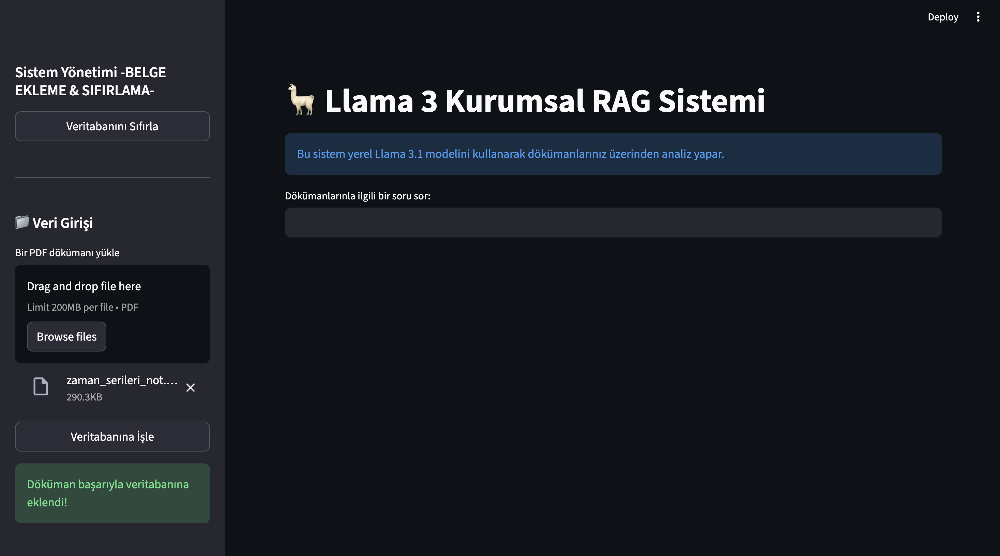

# 🦙 **Enterprise Knowledge Base (RAG)**

Kurumsal dokümanları anlayan, sorgulanabilir yapay zekâ tabanlı uygulama.

---

## **Overview**

Bu proje; şirket içi teknik dokümanları işleyip kullanıcının soru sorarak arama yapmasını sağlayan bir **RAG tabanlı kurumsal bilgi uygulamasıdır**.
LLM + vektör veritabanı sayesinde doğru, hızlı ve bağlama duyarlı cevaplar üretir.

---

## **Problem**

Kurumsal şirketlerde çalışanlar günlük olarak yüzlerce sayfa dokümanı incelemek zorunda kalır.
Bilgi dağınık, arama zor ve yanıt bulmak zaman alıcıdır.
**Tek bir bilgi kaynağı yoktur → verimlilik düşer.**

---

## **Solution**

Bu proje şirket içi tüm dokümanları toplar, işler ve vektör veritabanına ekler.
Kullanıcı doğal dilde soru sorduğunda sistem:

1. Sorguya göre en alakalı doküman parçalarını bulur,
2. LLM’e gönderir,
3. Kaynağa dayalı güvenilir cevap üretir.

---

##**Architecture**

* LangChain pipeline
* Embedding Model: `all-MiniLM-L6-v2`
* LLM: Llama 
* Vector DB: ChromaDB 
* Containerization: Docker
* Frontend: Streamlit 

---

## 🛠 **Tech Stack**

* **Python 3.10+**
* **FastAPI**
* **LangChain**
* **ChromaDB / Pinecone**
* **HuggingFace Embeddings**
* **Docker**
* **Streamlit** (UI için opsiyonel)


---

## ▶️ **Run Locally**

### 1️⃣ Install dependencies

```bash
pip install -r requirements.txt
```

### 2️⃣ run llama

```bash
run ollama : ollama run llama3
```

### 3️⃣ Start app

```bash
streamlit run app.py
```

### 4️⃣ Add new documents


---

### App

<div align="center">
    
    
    
    
</div>


### Short Demo